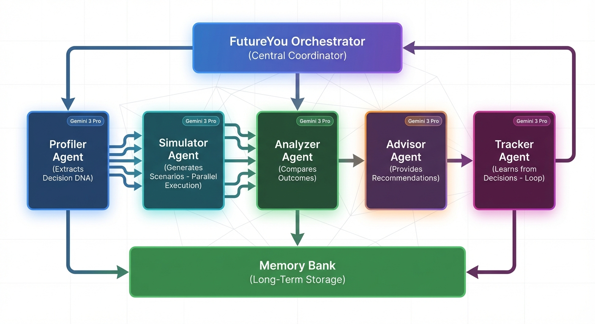
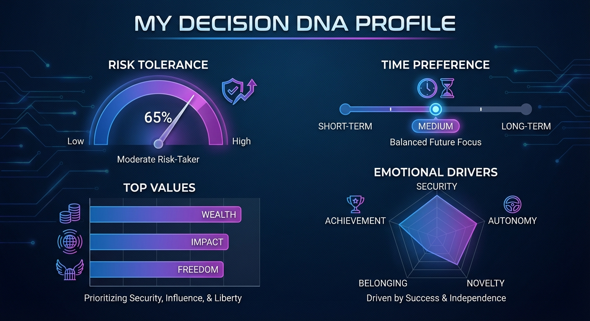
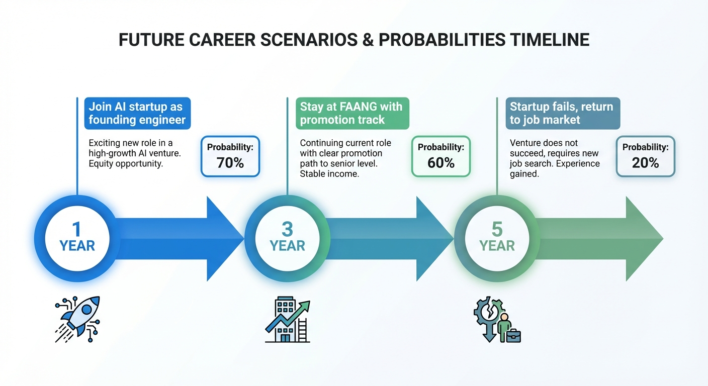
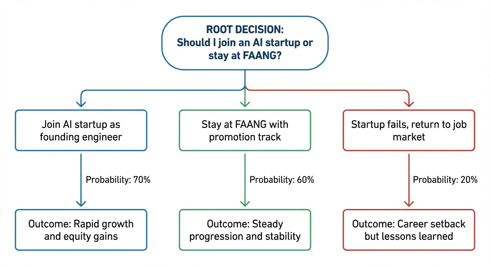

# 🔮 FutureYou: AI-Powered Personal Future Simulator

[](https://www.python.org/downloads/)
[](https://ai.google.dev/)
[](https://opensource.org/licenses/MIT)

**FutureYou** helps you make better life decisions by simulating multiple future scenarios using advanced AI agents. The system extracts your unique decision-making DNA and generates personalized, probabilistic futures across 1-year, 3-year, and 5-year timelines.

---

## 🌟 Key Features

- **🧬 Decision DNA™** - Quantifies your personal decision-making patterns
- **🌐 Multi-Timeline Simulation** - Parallel scenario generation across 1yr/3yr/5yr horizons
- **🎯 Value-Aligned Analysis** - Recommendations based on YOUR priorities
- **📊 Probabilistic Futures** - Realistic scenarios with probability scores
- **🔄 Continuous Learning** - System improves with each decision tracked
- **🎨 AI-Generated Visualizations** - Decision trees, timelines, and DNA profiles

---

## 🚀 Quick Start

### Installation

```bash
# Fork this repository on GitHub, then clone your fork
git clone https://github.com/YOUR_USERNAME/futureyou-ai-agents.git
cd futureyou-ai-agents

# Install dependencies
pip install -r requirements.txt

# Configure API key
cp .env.example .env
# Edit .env and add your GEMINI_API_KEY
```

**Alternative: Direct Clone (Read-only)**
```bash
# For quick testing without contributing
git clone https://github.com/pghosh5/futureyou-ai-agents.git
cd futureyou-ai-agents
```

### Pre-flight Check

Before running, validate your setup:

```bash
python config_validator.py
```

### Usage

#### Option 1: JSON Input Mode (Recommended)

Edit `futureyou_input.json` with your profile and decision:

```json
{
  "user_profile": {
    "user_id": "your_id",
    "age": 28,
    "current_role": "Your Role",
    "skills": ["Skill1", "Skill2"],
    "life_goals": ["Goal1", "Goal2"]
  },
  "decision": "Your decision question here",
  "timelines": ["1yr", "3yr", "5yr"],
  "generate_visuals": true
}
```

Run the simulation:

```bash
python futureyou.py
```

#### Option 2: Interactive Mode

For step-by-step guided input:

```bash
python futureyou_interactive.py
```

#### Option 3: Run Tests

To run unit tests:

```bash
python test_futureyou.py
```

---

## 📁 Project Structure

```
futureyou/
├── futureyou.py              # Main simulation engine
├── futureyou_interactive.py  # Interactive CLI interface
├── futureyou_input.json      # Input configuration file
├── visualizer.py             # AI visualization generator
├── result_visualizer.py      # HTML report generator
├── config_validator.py       # System configuration validator
├── test_futureyou.py        # Unit tests
├── requirements.txt          # Python dependencies
├── .env.example             # Environment template
├── README.md                # This file
├── QUICKSTART.md            # Quick start guide
├── ARCHITECTURE.md          # Technical architecture
├── TROUBLESHOOTING.md       # Troubleshooting guide
├── LICENSE                  # MIT License
├── futureyou.log            # Application logs
├── docs/images/             # Documentation images
└── results/                 # Output directory
    ├── outputs/             # JSON and HTML reports
    └── visualizations/      # Generated images
```

---

## 🏗️ Architecture

FutureYou implements a sophisticated multi-agent system with five specialized AI agents:



```
ProfilerAgent → SimulatorAgent → AnalyzerAgent → AdvisorAgent
     ↓              ↓ (parallel)      ↓              ↓
DecisionDNA → FutureScenarios → Analysis → PersonalizedAdvice
     ↓              ↓              ↓              ↓
          TrackerAgent ← MemoryBank ← Session
```

### Agent Roles

1. **ProfilerAgent** - Extracts Decision DNA from user profile
2. **SimulatorAgent** - Generates 3 scenarios per timeline (optimistic, realistic, pessimistic)
3. **AnalyzerAgent** - Compares scenarios and calculates alignment scores
4. **AdvisorAgent** - Provides personalized recommendations with action plans
5. **TrackerAgent** - Learns from decision outcomes over time

For detailed architecture information, see [ARCHITECTURE.md](ARCHITECTURE.md).

---

## 📊 Technology Stack

- **LLM:** Gemini 3 Pro Preview
- **Image Generation:** Gemini 3 Pro Image Preview
- **Language:** Python 3.10+
- **Key Libraries:** google-generativeai, tenacity, python-dotenv, Pillow

---

## 🎯 Key Concepts Demonstrated

This project showcases advanced AI agent development concepts:

### ✅ Multi-Agent System
- Sequential agent workflow (Profiler → Simulator → Analyzer → Advisor)
- Parallel processing (Simulator runs multiple timelines simultaneously)
- Loop agent (Tracker provides continuous learning)
- LLM-powered agents using Gemini 3 Pro

### ✅ Sessions & Memory
- Session management with full state tracking
- Long-term memory storage (MemoryBank)
- Conversation history persistence

### ✅ Context Engineering
- Decision DNA extraction (compact user representation)
- Context compaction from extensive user history
- Dynamic context adaptation

### ✅ Observability
- Comprehensive logging of agent activities
- Decision flow tracing through pipeline
- Performance metrics and quality scores

### ✅ Agent Evaluation
- Scenario quality scoring (probability and realism)
- Alignment scoring (DNA match calculation)
- Outcome tracking (prediction vs reality)

### ✅ Custom Tools
- DNA extractor for pattern recognition
- Scenario generator for multi-timeline simulation
- Retry logic with exponential backoff
- AI-powered visualization generation

---

## 🎨 Visual Examples

### Decision DNA Visualization


### Timeline Simulation


### Decision Tree


---

## 💡 Example Output

```
🔮 FutureYou: Simulating your decision...

📊 Profiler Agent: Analyzing your Decision DNA...
✅ Decision DNA extracted: Risk=0.65, Values=['career', 'wealth', 'freedom']

🌐 Simulator Agent: Generating scenarios for 3 timelines...
  ✓ 1yr: 3 scenarios generated
  ✓ 3yr: 3 scenarios generated
  ✓ 5yr: 3 scenarios generated

🔍 Analyzer Agent: Comparing scenarios...
✅ Analysis complete: Best scenario identified

💡 Advisor Agent: Crafting personalized recommendations...
✅ Recommendations ready

📊 SIMULATION RESULTS
================================================================================

🧬 Your Decision DNA:
  • Risk Tolerance: 0.65 (Moderate-High)
  • Time Preference: medium
  • Top Values: career, wealth, freedom

🌐 Generated 9 Future Scenarios

  [1yr] Join startup as founding engineer
    Probability: 70%
    Key Outcome: Rapid skill growth, equity potential

  [3yr] Startup achieves Series B funding
    Probability: 45%
    Key Outcome: Significant equity value, leadership role

  [5yr] Startup IPO or acquisition
    Probability: 25%
    Key Outcome: Financial independence achieved

💡 Personalized Advice:
Based on your Decision DNA, I recommend joining the startup with these conditions:

30-Day Action Plan:
1. Negotiate for 0.5-1% equity minimum
2. Ensure 6-month runway savings
3. Get written role/responsibility clarity

[... detailed advice continues ...]

✅ Session saved: session_1234567890
📁 Results saved to: results/outputs/
🎨 Visualizations saved to: results/visualizations/
```

---

## 📚 Documentation

- **[QUICKSTART.md](QUICKSTART.md)** - Get started in 5 minutes
- **[ARCHITECTURE.md](ARCHITECTURE.md)** - Deep dive into system design
- **[TROUBLESHOOTING.md](TROUBLESHOOTING.md)** - Common issues and solutions

---

## 🔧 Configuration

### Environment Variables

Create a `.env` file with:

```bash
GEMINI_API_KEY=your_gemini_api_key_here
```

### Input Configuration

Edit `futureyou_input.json` to customize:
- User profile information
- Decision scenario
- Timeline selection (1yr, 3yr, 5yr)
- Visualization preferences

---

## 📈 Innovation Highlights

### Decision DNA™
First system to extract and quantify personal decision-making patterns:
- Risk tolerance scoring (0-1 scale)
- Value priority ranking
- Historical pattern analysis
- Emotional driver identification

### Multi-Timeline Simulation
Unique parallel simulation across multiple time horizons:
- Immediate (1yr), medium (3yr), long-term (5yr) impacts
- Probabilistic outcomes with realistic scenarios
- Parallel execution for efficiency

### Value-Aligned Recommendations
Personalized advice based on individual DNA:
- Not generic pros/cons lists
- Actionable 30/60/90 day plans
- Contingency strategies for different outcomes

---

## 🤝 Contributing

Contributions, issues and feature requests are welcome!

---

## 📄 License

MIT License - See [LICENSE](LICENSE) file for details.

---

## 🙏 Acknowledgments

- Built with Google Gemini 3 Pro

---

## 🔧 Troubleshooting

If you encounter issues:

1. **Run the validator**: `python config_validator.py`
2. **Check logs**: View `futureyou.log` for detailed error information
3. **Review guide**: See [TROUBLESHOOTING.md](TROUBLESHOOTING.md) for common solutions
4. **Run tests**: Execute `python test_futureyou.py` to verify functionality

## 📞 Support

For questions or issues:
- Check [TROUBLESHOOTING.md](TROUBLESHOOTING.md) for common problems
- Review [QUICKSTART.md](QUICKSTART.md) for setup help
- See [ARCHITECTURE.md](ARCHITECTURE.md) for technical details
- Open an issue on GitHub

---

**FutureYou** - Make better decisions by simulating your future 🔮

